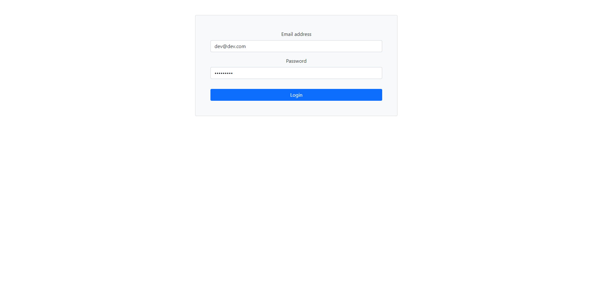
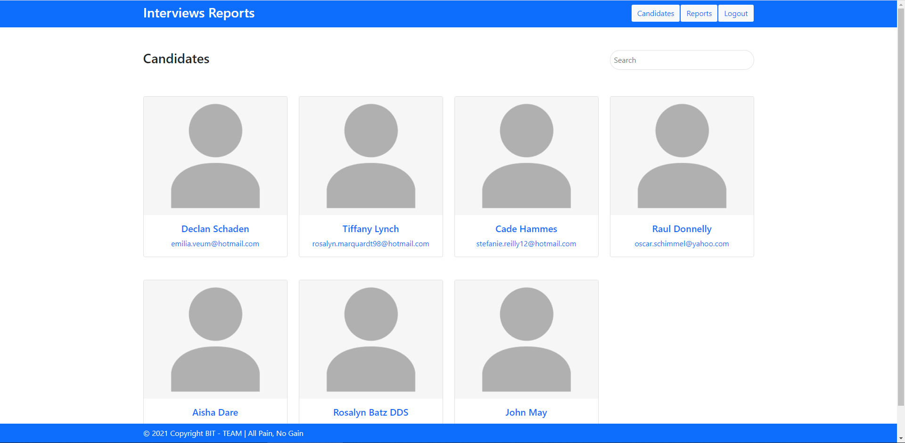
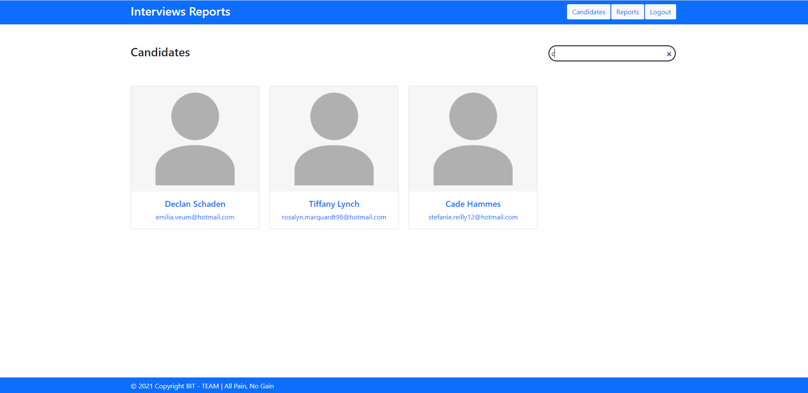
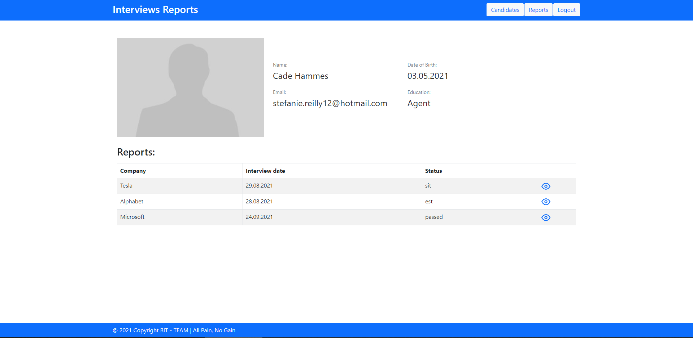
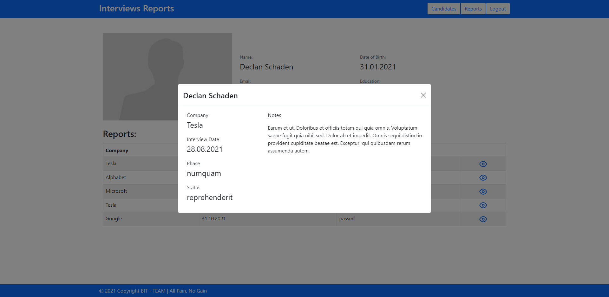
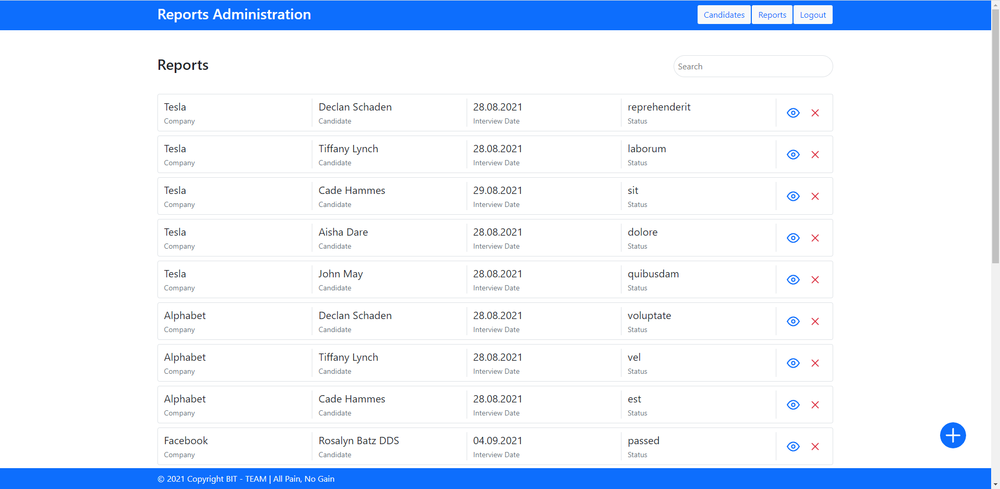
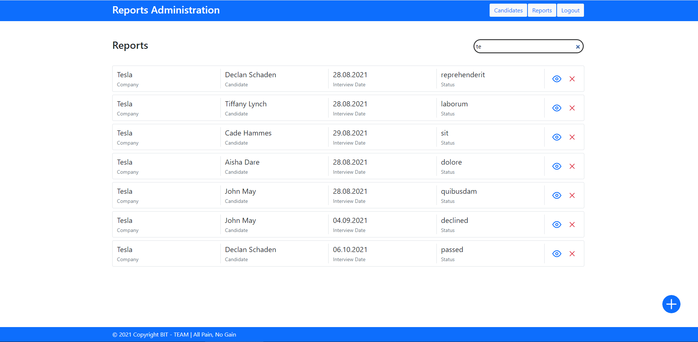
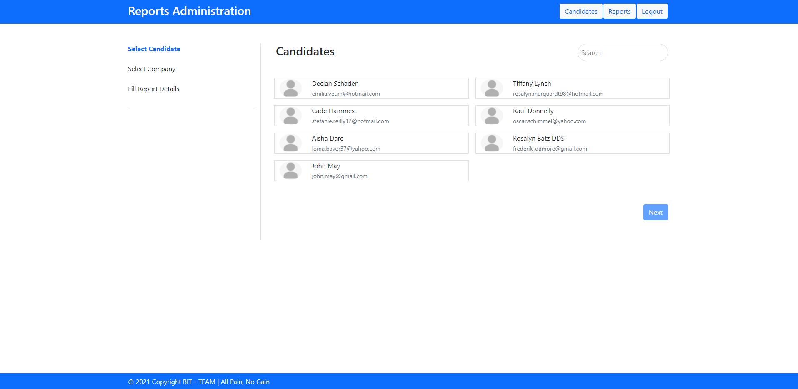
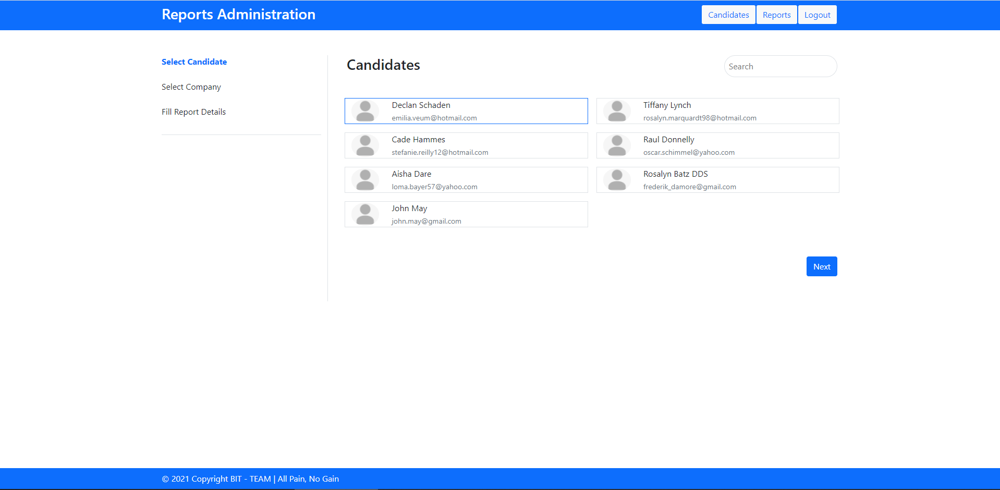

# Interview reports app

React SPA for tracking informations about companies, candidates and job interviews.
Local web server was used as an [API](https://github.com/nenadbugaric/interviews-reports-api-mock/).

App has:
 ### Login Page  
 for getting accessToken 
 

 ### Main Page
 contains:
- Header which has two navigation buttons (Candidates and Reports) and Logout button
- Sticky Footer
- List of Candidates (landing page)
- Candidates appear in cards layout. Each card contains name, avatar and email

- Candidates can be filtered by Candidate name

### Candidate Reports Page
by clicking on the candidate card, user is guided to this page, which contains all details about candidate:
- Name
- Avatar 
- Email 
- Education
- Date of Birth
- List of all reports related to the selected candidate is shown, including: company, interview date and status

- click on eye icon opens modal with report details

## Administrative Panel – Bonus Project Extension

- Responsive administrative panel which is responsible for creating/modifying/deleting Interview Reports
- Administrative Panel consists of:

### 1. Report list 
- Reports are rendered in a list

- Each Report can be viewed in more detail or deleted

- List of reports can be filtered by candidate or company name

### 2. Submit Report Page
- Submitting a Report is done through a “Wizard” which is constructed from three steps
- Wizard is open when user clicks on a "plus" icon on reports page
#### Step 1: Select a Candidate
-	Candidates appear in a list
-	List of Candidates can be filtered by Candidate Name
-	When user click on candidate it’s selected
-	After Candidate is selected “Next” button become enabled and user can click on it
-	When user click on “Next” button next section “Select Company” should be presented

#### Step 2: Select a Company

-	Companies appear in a list
-	List of Companies can be filtered by Company Name
- After Company is selected “Next” button become enabled and user can click on it
-	When user click on “Next” button next section “Fill Report Details” is presented

#### Step 3: Fill Report Details
-	User can enter all Report fields:
-	Date
-	Phase: cv, hr, tech, final
-	Status: passed, declined
-	Notes
-	All input fields are required
-	Phase must be one of: cv, hr, tech, final
-	Status must be one of: passed, declined 
-	Date can not be in the future
-	Date input is provided via date-picker component
- When the user clicks “Submit”, a request with all data for creating a report is sent
-	After successfully created report user is redirected to the reports page

